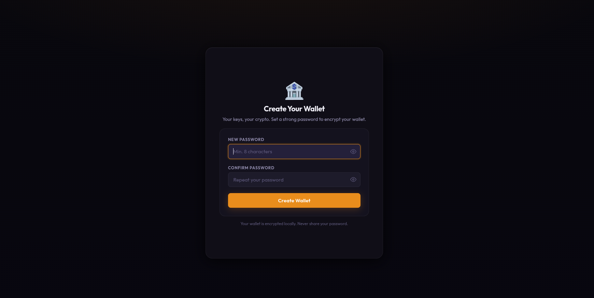
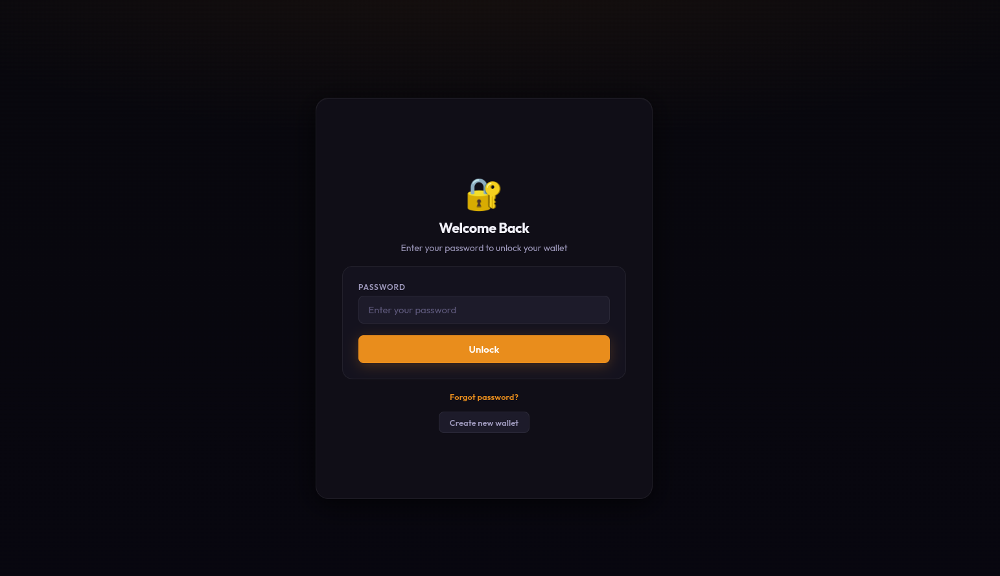
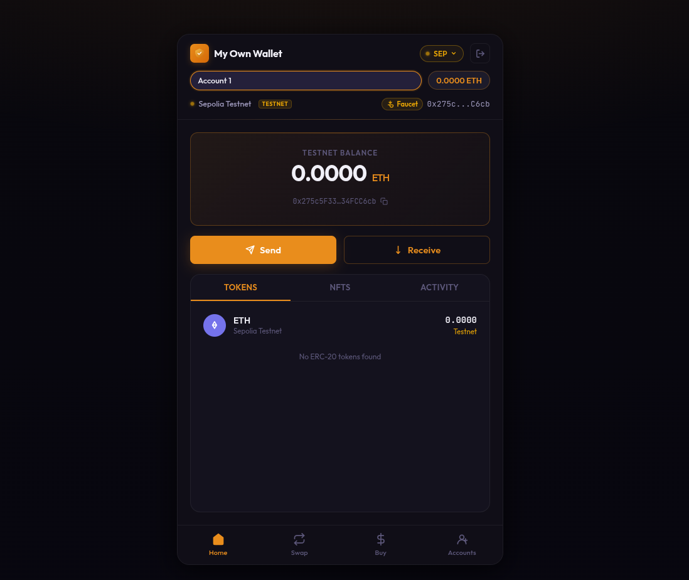

# 🦊 My Own Wallet

**A self-custodial Web3 wallet — Chrome Extension + Web App**

[](https://react.dev)
[](https://vitejs.dev)
[](https://docs.ethers.org)
[](https://mongodb.com)
[](LICENSE)

A non-custodial Ethereum wallet built with React + Ethers.js. Runs as a Chrome Extension and a web app from the same codebase. Private keys never leave your browser.

---

## Screenshots

|                   Register                   |                 Login                  |                   Dashboard                    |
| :------------------------------------------: | :------------------------------------: | :--------------------------------------------: |
|  |  |  |

> Add screenshots to `docs/screenshots/` — run `npm run dev`, open DevTools → Device Toolbar → **520 × 700 px**, screenshot each screen.

---

## Features

|     | Feature              |                                                           |
| --- | -------------------- | --------------------------------------------------------- |
| 🔐  | **Wallet creation**  | Keys generated + AES-encrypted locally, never transmitted |
| 🌐  | **20 EVM networks**  | 10 mainnets + 10 testnets, auto RPC fallback              |
| 💰  | **Token balances**   | Native + ERC-20 with live USD prices                      |
| 🖼️  | **NFT gallery**      | ERC-721 / ERC-1155 with images, metadata, IPFS support    |
| 📋  | **Activity history** | Transaction list with method decoding + date groups       |
| 🔑  | **Forgot password**  | Re-encrypt wallet via private key, fully offline          |
| 🏦  | **Multi-account**    | Create, import, and switch accounts                       |
| ☁️  | **Cloud backup**     | Optional MongoDB sync — encrypted keystores only          |

---

## Tech Stack

### Frontend

| Package              | Version | Purpose                                                  |
| -------------------- | ------- | -------------------------------------------------------- |
| React                | 19      | UI framework                                             |
| Vite                 | 7       | Build tool — instant HMR, Rollup production bundle       |
| Ethers.js            | 6       | Wallet creation, signing, RPC calls, keystore encryption |
| qrcode.react         | latest  | QR code for receive address                              |
| react-toastify       | latest  | Toast notifications                                      |
| react-loader-spinner | latest  | Loading spinners                                         |

No external UI library — the entire dark theme is built with CSS Custom Properties.

### Backend

| Package            | Purpose                                          |
| ------------------ | ------------------------------------------------ |
| Express 4          | HTTP API server                                  |
| MongoDB + Mongoose | Wallet backup storage                            |
| jsonwebtoken       | Device authentication (no email/password needed) |
| bcryptjs           | Credential hashing                               |
| Helmet             | HTTP security headers                            |
| express-rate-limit | Abuse protection                                 |
| Joi                | Request validation                               |

The backend is **optional** — all wallet features work without it. It only provides cloud backup.

### Chrome Extension

- Manifest v3 with minimal permissions
- `chrome.storage.local` in extension, `localStorage` in web — single adapter handles both
- All external domains declared in `host_permissions` for CORS compliance
- Backend explicitly allows `chrome-extension://` origins

---

## Security

- Private keys are generated locally using `ethers.Wallet.createRandom()` and AES-encrypted with your password (JSON Keystore v3 standard)
- Decryption happens in memory only — the decrypted key is never written anywhere
- The server receives only the **encrypted** keystore JSON — never the key, password, or seed phrase
- Forgot password works by re-encrypting with your private key, entirely in-browser

---

## Project Structure

```
my-own-wallet/
├── .env                          ← RPC URLs and API keys
├── index.html                    ← Entry point (web + extension popup)
├── manifest.json                 ← Chrome Extension Manifest v3
├── background.js                 ← Extension service worker
│
├── src/
│   ├── App.jsx                   ← Global state + page router
│   ├── index.css                 ← Dark theme design system
│   │
│   ├── components/
│   │   ├── Layout.jsx            ← App shell, top bar, bottom nav
│   │   ├── BottomNav.jsx         ← Tab navigation
│   │   ├── AccountPanel.jsx      ← Accounts slide-up drawer
│   │   └── PasswordInput.jsx     ← Password field with toggle
│   │
│   ├── pages/
│   │   ├── Onboarding.jsx        ← Create wallet
│   │   ├── Unlock.jsx            ← Password unlock
│   │   ├── ForgotPassword.jsx    ← Reset password via private key
│   │   ├── Dashboard.jsx         ← Balance + Tokens / NFTs / Activity
│   │   ├── Send.jsx              ← Send crypto
│   │   ├── Confirm.jsx           ← Transaction confirmation
│   │   ├── Receive.jsx           ← QR code receive
│   │   ├── Swap.jsx              ← Token swap
│   │   ├── Buy.jsx               ← Fiat on-ramp
│   │   ├── ImportAccount.jsx     ← Import via private key
│   │   └── AccountDetails.jsx    ← Export key / rename / remove
│   │
│   ├── services/
│   │   ├── walletService.js      ← Create / decrypt / re-encrypt wallet
│   │   ├── storageService.js     ← State persistence + cloud sync trigger
│   │   ├── networkService.js     ← RPC provider with fallback chain
│   │   ├── transactionService.js ← Gas estimation + send tx
│   │   └── apiService.js         ← Backend API calls
│   │
│   ├── config/
│   │   └── networks.js           ← All 20 network configs
│   │
│   └── utils/
│       └── storage.js            ← chrome.storage ↔ localStorage adapter
│
└── server/
    └── src/
        ├── index.js              ← Express app
        ├── models/User.js        ← MongoDB schema
        ├── middleware/auth.js    ← JWT auth
        └── routes/               ← auth · wallet · activity
```

---

## Quick Start

**Requirements:** Node.js 18+, npm 9+, Chrome 109+ (for extension)

### Web App

```bash
npm install
npm run dev        # http://localhost:5173
```

### Chrome Extension

```bash
npm install
npm run build
```

1. Go to `chrome://extensions`
2. Enable **Developer mode**
3. Click **Load unpacked** → select `dist/`

> After changes: `npm run build` → click **↺** on the extension card.

### Backend (Optional)

```bash
cd server
npm install
cp .env.example .env   # set MONGODB_URI and JWT_SECRET
npm run seed           # create indexes (once)
npm run dev            # http://localhost:5000
```

---

## Environment Variables

### `.env` (frontend)

```env
# Mainnets — all free, no API key needed
VITE_ETH_RPC=https://eth.llamarpc.com
VITE_BSC_RPC=https://bsc-dataseed.binance.org
VITE_POLYGON_RPC=https://polygon.llamarpc.com
VITE_ARBITRUM_RPC=https://arb1.arbitrum.io/rpc
VITE_OPTIMISM_RPC=https://mainnet.optimism.io
VITE_AVAX_RPC=https://api.avax.network/ext/bc/C/rpc
VITE_BASE_RPC=https://mainnet.base.org
VITE_FTM_RPC=https://rpcapi.fantom.network
VITE_CRONOS_RPC=https://evm.cronos.org
VITE_LINEA_RPC=https://rpc.linea.build

# Testnets
VITE_SEPOLIA_RPC=https://ethereum-sepolia-rpc.publicnode.com
VITE_HOLESKY_RPC=https://holesky.publicnode.com
VITE_BSC_TESTNET_RPC=https://data-seed-prebsc-1-s1.binance.org:8545
VITE_MUMBAI_RPC=https://rpc-mumbai.maticvigil.com
VITE_ARB_SEPOLIA_RPC=https://sepolia-rollup.arbitrum.io/rpc
VITE_OP_SEPOLIA_RPC=https://sepolia.optimism.io
VITE_BASE_SEPOLIA_RPC=https://sepolia.base.org
VITE_FUJI_RPC=https://api.avax-test.network/ext/bc/C/rpc
VITE_FTM_TESTNET_RPC=https://rpc.testnet.fantom.network
VITE_LINEA_SEP_RPC=https://rpc.sepolia.linea.build

# Optional
# VITE_ETHERSCAN_KEY=YourKey     ← removes Activity tab rate limits
VITE_API_URL=http://localhost:5000/api
```

### `server/.env`

```env
MONGODB_URI=mongodb://localhost:27017/my_own_wallet
JWT_SECRET=your_long_random_secret
PORT=5000
CLIENT_ORIGIN=http://localhost:5173
NODE_ENV=development
```

---

## Supported Networks

**Mainnets:** Ethereum · BNB Chain · Polygon · Arbitrum · Optimism · Avalanche · Base · Fantom · Cronos · Linea

**Testnets:** Sepolia · Holesky · BSC Testnet · Mumbai · Arbitrum Sepolia · Optimism Sepolia · Base Sepolia · Fuji · Fantom Testnet · Linea Sepolia

All use free public RPCs with 3–4 automatic fallbacks. No API key required.

---

## Troubleshooting

**Balance shows 0** — Check DevTools console for `[Balance] failed` logs. All RPCs are free — if all fail, check your network connection.

**Activity rate limited** — Add a free Etherscan key: `VITE_ETHERSCAN_KEY=YourKey` in `.env`, then rebuild.

**`registerDevice failed`** — Backend not running. Wallet still works fully offline; this only affects cloud backup.

**NFT images missing** — IPFS can be slow. The app retries across 3 gateways automatically. Placeholder shown until image loads.

---

## Scripts

```bash
# Frontend
npm run dev        # dev server
npm run build      # production build → dist/
npm run preview    # preview build

# Backend
npm run dev        # server with hot reload
npm run seed       # create MongoDB indexes (once)
```

---

## License

MIT — free to use, modify, and distribute.

_Your keys. Your crypto. Your wallet._
